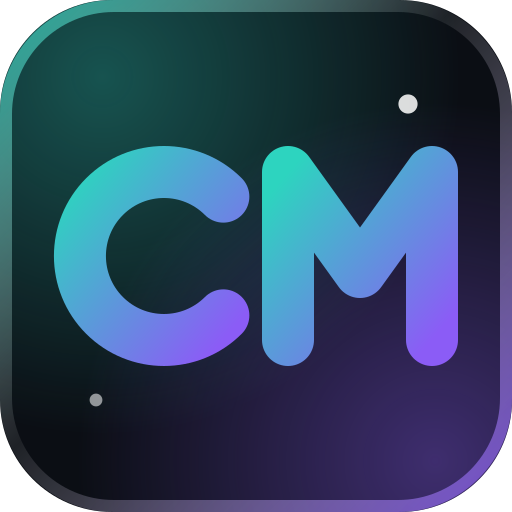
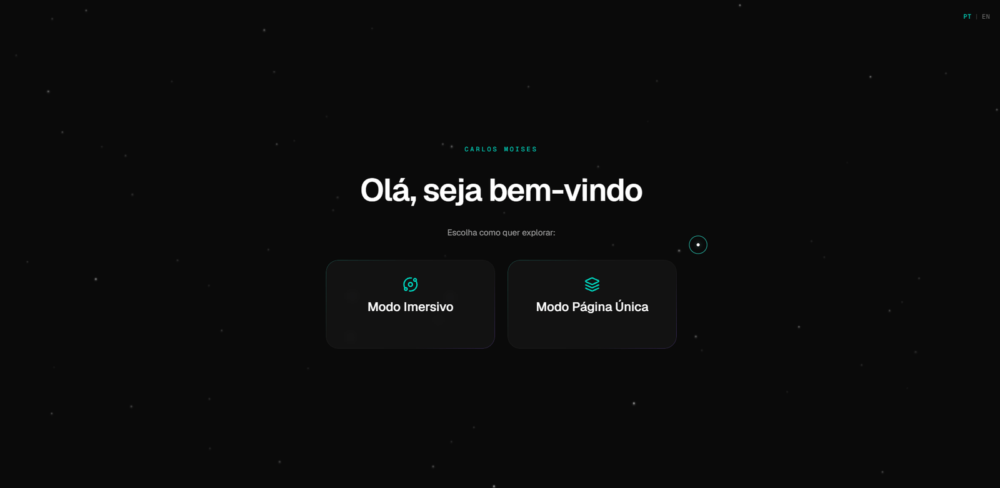
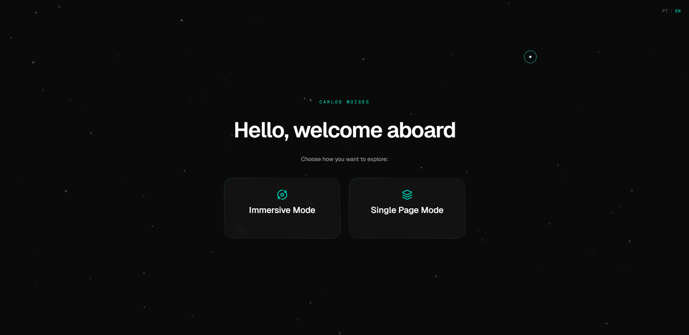
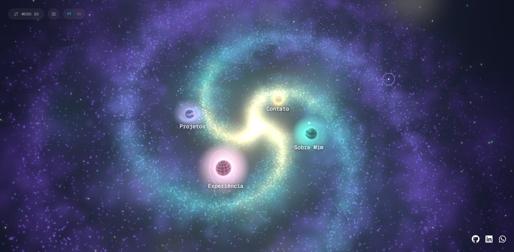
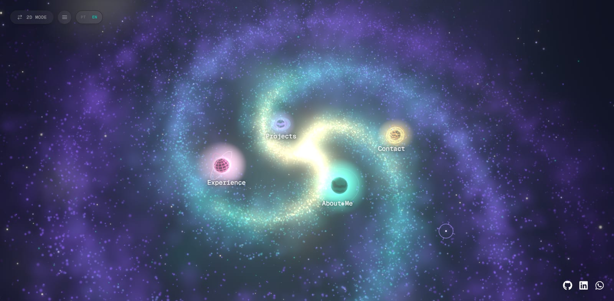
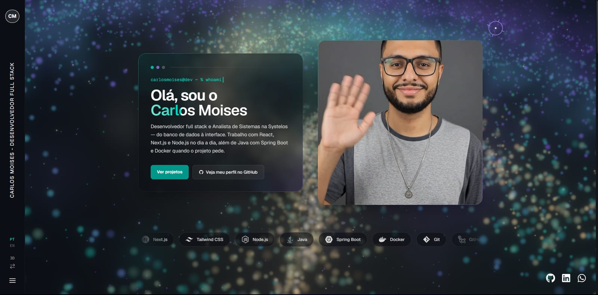
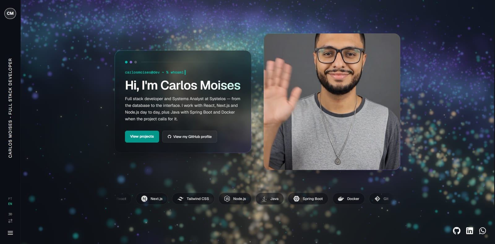
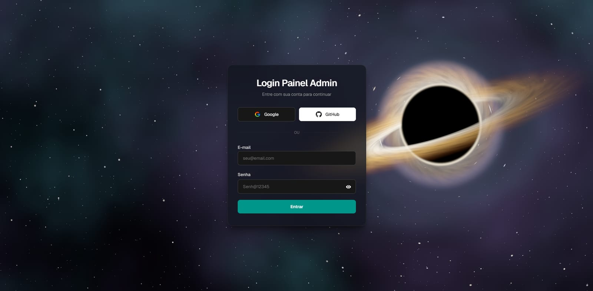
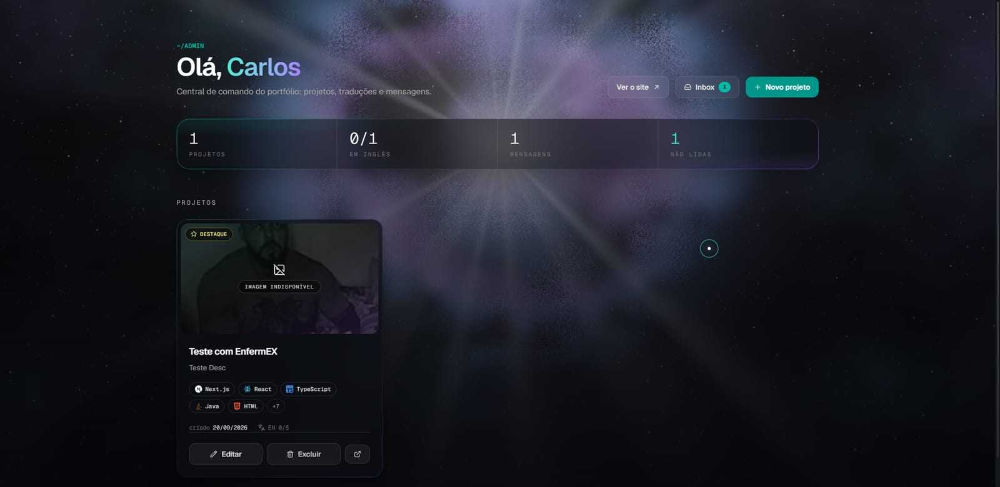

<p align="center">
  
</p>

<h1 align="center">Portfólio Via Láctea</h1>

<p align="center">
  Portfólio pessoal de <strong>Carlos Moises</strong>, desenvolvedor full stack.<br />
  Uma galáxia navegável em 3D <em>ou</em> uma página única, direto ao ponto. Você escolhe.
</p>

<p align="center">
  <a href="https://github.com/CarlosZeyy">GitHub</a> ·
  <a href="https://www.linkedin.com/in/carlosmoisesdev/">LinkedIn</a>
</p>

<p align="center">
  
  
  
  
  
  
  
</p>

---

## Sumário

- [Visão geral](#visão-geral)
- [Os dois modos de navegação](#os-dois-modos-de-navegação)
  - [Tela inicial](#tela-inicial)
  - [Modo Imersivo (3D)](#modo-imersivo-3d)
  - [Modo Página Única (2D)](#modo-página-única-2d)
- [Funcionalidades](#funcionalidades)
- [Stack](#stack)
- [Estrutura do projeto](#estrutura-do-projeto)
- [Rotas](#rotas)
- [Como funciona por dentro](#como-funciona-por-dentro)
- [Segurança](#segurança)
- [Rodando localmente](#rodando-localmente)
- [Configurando o Supabase](#configurando-o-supabase)
- [Testes](#testes)
- [Docker e deploy](#docker-e-deploy)
- [Identidade visual](#identidade-visual)
- [Autor](#autor)

---

## Visão geral

Este repositório é o código-fonte do meu portfólio. Além de apresentar quem eu sou, minha experiência e meus projetos, ele é em si um projeto: uma aplicação Next.js completa com renderização 3D em WebGL, internacionalização, painel administrativo autenticado, banco de dados com Row Level Security e empacotamento em Docker pronto para uma VPS.

O nome interno, `portfolio-via-lactea`, vem da ideia central: o conteúdo do site é uma galáxia. Cada seção (Sobre Mim, Experiência, Projetos, Contato) é um planeta orbitando um núcleo incandescente, e o visitante navega passando o mouse e dando zoom. Quem preferir algo mais tradicional escolhe o modo de página única, com as mesmas seções empilhadas.

**Em resumo:**

| | |
|---|---|
| Framework | Next.js 16 (App Router, Server Components, Server Actions) |
| 3D | Three.js via React Three Fiber, drei e postprocessing (Bloom) |
| Animação | Framer Motion (UI) e GSAP (câmera 3D) |
| Dados | Supabase: Postgres, Auth (Google, GitHub, e-mail/senha) e Storage |
| Idiomas | Português (pt-BR) e Inglês (en-US), com troca ao vivo |
| Deploy | Docker multi-stage, imagem `standalone` com usuário sem privilégios |

---

## Os dois modos de navegação

### Tela inicial

Na primeira visita o site pergunta como você quer explorar. A escolha fica em memória (Zustand) enquanto a aba estiver aberta, e o seletor de idioma no canto já funciona aqui.

| Português | Inglês |
|:---:|:---:|
|  |  |

### Modo Imersivo (3D)

Uma galáxia espiral procedural com quatro planetas em órbita. Cada planeta é a porta de uma seção.

| Português | Inglês |
|:---:|:---:|
|  |  |

**Como se navega:**

1. **Passe o mouse** sobre um planeta. A órbita pausa e a câmera passa a focar nele.
2. **Role a roda do mouse** para dar zoom. A câmera se aproxima suavemente (amortecida com GSAP) e, quando "pousa", um painel de vidro com o conteúdo da seção desliza para a tela.
3. **Role para trás** ou pressione **Esc** para voltar ao hub.
4. **Deep links** funcionam: voltar de um projeto para `/#projects` abre a seção direto, sem precisar dar zoom.

**Os planetas:**

| Planeta | Seção | Variante | Cor |
|---|---|---|---|
| Lua listrada | Sobre Mim | `moon` | Teal |
| Globo holográfico | Experiência | `gyro` | Rosa |
| Gigante com anéis | Projetos | `rings` | Violeta |
| Globo de grade | Contato | `lattice` | Âmbar |

Cada planeta ecoa uma cor da nébula, e o halo largo ("farol") que os torna localizáveis de longe se apaga no close-up para não lavar os detalhes.

### Modo Página Única (2D)

As mesmas seções empilhadas em uma única página rolável, com a nébula desfocada ao fundo. Sidebar fixa com o monograma CM, seletor de idioma, atalho para trocar para o modo 3D e menu.

| Português | Inglês |
|:---:|:---:|
|  |  |

O Hero simula um terminal (`carlosmoises@dev ~ % whoami`) com cursor piscando, seguido de um carrossel infinito com as stacks do dia a dia.

---

## Funcionalidades

### Para o visitante

- **Dois modos de exploração** (3D e 2D) que compartilham exatamente o mesmo conteúdo: os componentes das seções são montados uma vez no Server Component e entregues aos dois mundos.
- **Português e Inglês** com troca instantânea. A preferência persiste em `localStorage` e num cookie espelho, então o servidor já renderiza o HTML no idioma certo na próxima visita (sem "flash" de português para quem escolheu inglês).
- **Case study de cada projeto** em `/project/[id]`: título, descrição, stacks com ícones, links para repositório e deploy, vídeo do projeto rodando (com seletor Desktop / Mobile, o vídeo vertical aparece num mockup de celular), galeria de imagens com lightbox e a narrativa em três blocos: O Problema, A Solução e Desafios Técnicos.
- **Projetos traduzidos campo a campo**: um projeto com só o título em inglês mostra o título em inglês e o restante em português, em vez de esconder tudo até a tradução ficar completa.
- **Formulário de contato** com validação (Zod), honeypot contra bots, mensagens de erro traduzidas e persistência no banco. Em desenvolvimento, sem a tabela criada, ele entra em modo mock para não travar o trabalho.
- **Cursor customizado** (anel que abre sobre elementos clicáveis e vira mira sobre os planetas) e **scrollbar** com o degradê da nébula. Ambos desenhados para não custar FPS ao lado do canvas WebGL.
- **Acessibilidade**: respeita `prefers-reduced-motion` (animações desligam e o fundo 3D do admin vira imagem estática), painéis com `role="dialog"`, foco de teclado gerenciado, Esc fecha modais na ordem certa.
- **Metadados dinâmicos**: `<title>` e Open Graph de cada projeto no idioma do visitante.

### Para o administrador (`/admin`)

| Login (`/login`) | Dashboard (`/admin`) |
|:---:|:---:|
|  |  |

O painel vive sobre um canvas WebGL próprio: um **buraco negro** com disco de acreção na tela de login e uma **supernova** nas demais páginas. Os cards de vidro mostram projetos, progresso da tradução para inglês, total de mensagens e não lidas.

- **Login** com Google, GitHub ou e-mail/senha via Supabase Auth.
- **Dashboard** com a lista de projetos (destaque, stacks, data de criação, progresso EN), contagem de mensagens e não lidas, e atalhos para o site, a inbox e um novo projeto.
- **CRUD de projetos** com formulário em abas PT / EN, indicador de progresso da tradução, upload de thumbnail e galeria direto para o Supabase Storage (limite de 25 MB por envio) e URLs de vídeo desktop e mobile.
- **Inbox** de mensagens do formulário de contato, com filtro de não lidas, marcar como lida e excluir.
- **Cenas 3D próprias**: um buraco negro na tela de login e uma supernova nas demais páginas, ambos em shaders GLSL, limitados a 30 fps para não gastar GPU numa tela de formulário.

---

## Stack

| Camada | Tecnologias |
|---|---|
| Framework | Next.js 16 (App Router), React 19, TypeScript 5 |
| Estilo | Tailwind CSS 4, fonte Geist (Sans e Mono) |
| 3D | three, @react-three/fiber, @react-three/drei, @react-three/postprocessing |
| Animação | framer-motion, gsap + @gsap/react |
| Estado | zustand |
| Validação | zod |
| i18n | i18next, react-i18next |
| Backend | Supabase (@supabase/ssr, @supabase/supabase-js) |
| Ícones | react-icons |
| Infra | Docker, docker compose, ESLint 9 |

---

## Estrutura do projeto

```text
portfolio-v2/
├─ docs/readme/               # imagens deste README
├─ public/
│  ├─ avatar/                 # foto e vídeo do hero
│  ├─ cv/                     # currículo em PDF
│  └─ fallback-thumb.jpeg     # thumbnail padrão de projeto
├─ supabase/
│  └─ migration_and_security_patch.sql   # estrutura + RLS, idempotente
├─ src/
│  ├─ app/
│  │  ├─ (public)/            # site: home, /project/[id], action de contato
│  │  ├─ (admin)/             # painel: /login, /admin, /admin/new, /admin/edit/[id], /admin/messages
│  │  ├─ api/
│  │  │  ├─ health/           # healthcheck do container
│  │  │  └─ user/             # callback OAuth do Supabase
│  │  ├─ layout.tsx           # raiz: fontes, I18nProvider, cursor
│  │  ├─ favicon.ico · icon.svg · apple-icon.png
│  │  └─ globals.css          # tema, glass-ring, scrollbar, cursor
│  ├─ components/
│  │  ├─ SpaceBackground.tsx  # <Canvas> com galáxia, planetas, bloom
│  │  ├─ Galaxy.tsx           # nébula procedural (1 draw call)
│  │  ├─ Planet.tsx · NavStar.tsx
│  │  ├─ CameraRig3D.tsx      # hover, zoom, pouso, deep link
│  │  ├─ CameraRig2D.tsx      # parallax suave do modo 2D
│  │  ├─ ContentOverlay.tsx   # painel de vidro das seções no 3D
│  │  ├─ View2D.tsx · SplashScreen.tsx
│  │  ├─ Hero · About · Experience · ProjectGallery · Contact
│  │  ├─ ProjectClient.tsx    # case study
│  │  ├─ CustomCursor.tsx · Sidebar · MobileHeader · MenuOverlay · SocialDock
│  │  ├─ admin/               # dashboard, formulário, inbox
│  │  └─ admin-scenes/        # BlackHole3D, Supernova3D, shaders GLSL
│  ├─ i18n/
│  │  ├─ locales/pt-BR.ts · en-US.ts
│  │  ├─ settings.ts · client.ts · server.ts · I18nProvider.tsx
│  │  └─ useLocalizedProject.ts
│  ├─ lib/
│  │  ├─ envSchema.ts         # valida as variáveis de ambiente no boot
│  │  ├─ auth.ts              # requireAdmin()
│  │  ├─ supabase.ts · supabase-server.ts
│  │  ├─ projectSchema.ts · projectLocale.ts · contactSchema.ts
│  │  ├─ stackIcons.ts        # nome da stack -> ícone
│  │  └─ motion.ts · formats.ts · seededRandom.ts
│  └─ store/
│     ├─ useOrbitStore.ts     # hover, foco, zoom e seção ativa do 3D
│     └─ useMenuStore.ts      # menu, modo 2D/3D
├─ Dockerfile · docker-compose.yml · .dockerignore
├─ next.config.ts             # output: standalone, bodySizeLimit 25mb
└─ .env.example
```

---

## Rotas

| Rota | Tipo | Descrição |
|---|---|---|
| `/` | pública | Splash, hub 3D ou página única |
| `/project/[id]` | pública | Case study do projeto |
| `/login` | pública | Login do painel (Google, GitHub, e-mail) |
| `/admin` | protegida | Dashboard |
| `/admin/new` | protegida | Novo projeto |
| `/admin/edit/[id]` | protegida | Editar projeto |
| `/admin/messages` | protegida | Inbox (`?filter=unread` mostra só não lidas) |
| `/api/user` | pública | Callback OAuth: troca o `code` por sessão e redireciona para `/admin` |
| `/api/health` | pública | `{ "status": "ok" }` para o healthcheck do Docker |

---

## Como funciona por dentro

### Server Components entregam dados aos dois modos

A home é um Server Component que busca os projetos no Supabase uma vez e monta os componentes das seções. Esses nós React são passados tanto para a árvore do modo 2D quanto para o painel do modo 3D. Só um dos dois está montado por vez, então não há fetch duplicado nem estado dessincronizado.

### O hub 3D em números

- A nébula inteira é **um único draw call**: quatro populações de sprites (bulbo, poeira, nuvens e grãos) somadas com blending aditivo. O que parece fumaça são milhares de gaussianas macias em escalas diferentes.
- O **DPR é limitado a 1.5** (mínimo 0.75, ajustado pelo `PerformanceMonitor` do drei). Névoa aditiva é puro fill-rate e o custo cresce com o quadrado do DPR.
- Nenhum `new Vector3()` dentro de `useFrame`: os vetores de rascunho são reutilizados para não gerar lixo para o GC a 60 fps.
- A entrada na seção usa **histerese** (entra acima de 0.95 de zoom, sai abaixo de 0.8). Sem isso, um trackpad faria o painel piscar em volta do limiar.
- O registro planeta → `Object3D` vive fora do Zustand de propósito: é uma ponte para a câmera ler posições a cada frame, não estado de UI, e nunca dispara re-render.
- O enquadramento do hub é calculado em pixels de margem para os rótulos, então a composição é a mesma no desktop e no celular em retrato.

### Internacionalização sem erro de hidratação

O idioma nasce no servidor: `getRequestLocale()` lê o cookie espelho ou, na primeira visita, o cabeçalho `Accept-Language`. O `I18nProvider` cria **uma instância do i18next por requisição** (um singleton vazaria o idioma de um visitante para o HTML do próximo) e inicializa de forma síncrona, para o primeiro render já sair traduzido.

Se o `localStorage` e o cookie divergirem (cookie expirou, por exemplo), o provider regrava o cookie e recarrega uma única vez em vez de trocar o idioma no meio do streaming, o que causaria erro de hidratação.

### Formulários com Server Actions

Contato e projetos usam `useActionState` com Server Actions. Como o React 19 reseta o `<form>` ao fim de toda action, o estado devolve os valores digitados para o usuário não perder a mensagem por causa de um e-mail inválido. As mensagens de erro são **chaves do dicionário**, não texto: a action roda no servidor, não sabe o idioma do visitante, e o cliente traduz.

### Cursor customizado sem custar FPS

O componente renderiza uma vez. Mover o mouse não chama `setState`: a posição vai direto para `transform` via `requestAnimationFrame`, e o anel segue com um atraso amortecido que para de animar quando chega (não há loop rodando à toa).

---

## Segurança

O painel tem **duas camadas** de proteção, e a segunda é a que importa:

1. **`requireAdmin()`** nas páginas e em **toda Server Action** do painel. Server Actions são endpoints HTTP públicos: qualquer um pode chamá-las com um POST sem abrir `/admin`, então a checagem mora na action, não só na página. Estar logado não basta: o login aceita qualquer conta Google ou GitHub. Quem entra é quem está em `ADMIN_EMAILS`.
2. **Row Level Security no Postgres**. Um usuário logado pode chamar a API REST do Supabase direto com o próprio token, sem passar pelo Next. As policies comparam o e-mail do JWT:
   - `projects`: todos leem; só o admin insere, atualiza e deleta.
   - `messages`: qualquer visitante insere (com `is_read = false` obrigatório); só o admin lê, atualiza e deleta.

Detalhes que valem a pena conhecer:

- Com RLS, um UPDATE ou DELETE sem permissão **não devolve erro**: afeta zero linhas e responde sucesso. Por isso as actions da inbox pedem as linhas de volta com `.select("id")` e tratam "nenhuma linha" como falha.
- O formulário de contato não faz `.select()` após o insert, porque a policy do `anon` é só de INSERT.
- As variáveis `NEXT_PUBLIC_*` são públicas por design (vão no bundle do cliente); a proteção real é o RLS. Nenhum segredo de verdade (service role, chaves de API) entra no build.
- O container roda como usuário sem privilégios, com sistema de arquivos somente leitura, todas as capabilities removidas e `no-new-privileges`.

---

## Rodando localmente

**Requisitos:** Node.js 20.9 ou superior (recomendado 22) e uma conta no Supabase.

```bash
git clone https://github.com/CarlosZeyy/portfolio-v2.git
cd portfolio-v2
npm install
cp .env.example .env.local   # e preencha (ver abaixo)
npm run dev
```

Abra <http://localhost:3000>.

### Variáveis de ambiente

| Variável | Onde é lida | Descrição |
|---|---|---|
| `NEXT_PUBLIC_SUPABASE_URL` | build | URL do projeto Supabase |
| `NEXT_PUBLIC_SUPABASE_PUBLIC_ANON_KEY` | build | Chave anônima (pública) |
| `ADMIN_EMAILS` | runtime | E-mails autorizados no `/admin`, separados por vírgula |

O arquivo `src/lib/envSchema.ts` valida as duas primeiras com Zod no boot: sem elas o build falha cedo, com mensagem legível, em vez de uma imagem "pronta" que quebra na primeira requisição. Sem `ADMIN_EMAILS` o painel aceita qualquer conta logada (o RLS continua barrando a escrita) e registra um aviso a cada acesso.

### Scripts

| Script | O que faz |
|---|---|
| `npm run dev` | Servidor de desenvolvimento |
| `npm run build` | Build de produção (gera `.next/standalone`) |
| `npm run start` | Serve o build |
| `npm run lint` | ESLint |
| `npm run typecheck` | `next typegen` + `tsc --noEmit` |
| `npm test` | Testes unitários e de componente (Vitest) |
| `npm run test:watch` | Idem, reexecutando ao salvar |
| `npm run test:coverage` | Idem, com relatório em `coverage/` |
| `npm run test:e2e` | Testes end-to-end (Playwright); rode `npm run build` antes |
| `npm run test:e2e:ui` | Idem, com a interface visual do Playwright |
| `npm run docker:up` | Builda a imagem e sobe o container |
| `npm run docker:logs` | Acompanha os logs do container |
| `npm run docker:down` | Derruba o container |

---

## Configurando o Supabase

1. **Crie um projeto** no Supabase e copie a URL e a anon key para o `.env.local`.
2. **Crie a tabela `projects`** (pelo dashboard ou SQL) com as colunas abaixo. A tabela `messages` é criada pela migração.
3. **Rode a migração**: cole o conteúdo de `supabase/migration_and_security_patch.sql` no SQL Editor e execute. O script é idempotente (pode rodar quantas vezes quiser), roda numa transação, adiciona as colunas de tradução e `video_mobile_url`, remove todas as policies antigas e recria as certas.
   > O script compara o e-mail do JWT com um endereço fixo. Se você reutilizar o projeto, troque esse e-mail nas policies antes de rodar.
4. **Crie o bucket `portfolio-media`** em Storage, marcado como **público**. É para lá que vão thumbnails e galerias.
5. **Ative os provedores** Google e/ou GitHub em Authentication → Providers e adicione `http://localhost:3000/api/user` (e a URL de produção equivalente) em Redirect URLs.

### Tabelas

**`projects`**

| Coluna | Tipo | Observação |
|---|---|---|
| `id` | uuid | PK |
| `title`, `description` | text | obrigatórios |
| `thumbnail_url` | text | obrigatório |
| `stacks` | text[] | nomes que casam com `stackIcons.ts` |
| `repo_url` | text | obrigatório |
| `deploy_url`, `video_url`, `video_mobile_url` | text | opcionais |
| `is_featured` | boolean | |
| `problem_description`, `solution_description`, `technical_challenges` | text | narrativa do case study |
| `gallery_urls` | text[] | |
| `title_en`, `description_en`, `problem_description_en`, `solution_description_en`, `technical_challenges_en` | text | `NULL` = sem tradução, mostra o português |
| `created_at` | timestamptz | |

**`messages`**

| Coluna | Tipo | Observação |
|---|---|---|
| `id` | uuid | PK |
| `name` | text | 2 a 80 caracteres |
| `email` | text | até 160 caracteres |
| `message` | text | 10 a 2000 caracteres |
| `is_read` | boolean | default `false` |
| `created_at` | timestamptz | índice `(is_read, created_at desc)` para a inbox |

---

## Testes

Três camadas, todas executadas no CI antes de qualquer deploy:

| Camada | Ferramenta | O que cobre |
|---|---|---|
| Unitária | Vitest | Schemas (contato, projeto, env), formatação, `mailto:` seguro, gerador determinístico, i18n no servidor, store do hub 3D, Server Action de contato, rota de health |
| Componente | Vitest + Testing Library | `StackChip`, `ConfirmButton`, `LanguageToggle` |
| End-to-end | Playwright | Health, 404, idioma pelo Accept-Language e pelo cookie, `/login`, redirect de `/admin` |

```bash
npm test              # unitários + componente
npm run build && npm run test:e2e
```

Cada teste está explicado em [docs/testes.md](docs/testes.md).

---

## Docker e deploy

```bash
npm run docker:up      # builda e sobe em http://localhost:3000
npm run docker:logs
npm run docker:down
```

Numa VPS, renomeie `.env.local` para `.env` e rode `docker compose up -d --build` sem flags. Atrás de um proxy reverso (Nginx, Caddy, Traefik), troque a porta no compose por `127.0.0.1:3000:3000` para o app não ficar exposto direto na internet.

**O `Dockerfile` tem três estágios:**

1. **deps**: `npm ci` com cache mount. Só reinstala quando o `package-lock.json` muda.
2. **builder**: recebe as duas variáveis `NEXT_PUBLIC_*` como build args (elas são embutidas no bundle, então precisam existir no build) e roda `next build`. Falha com mensagem clara se faltar alguma.
3. **runner**: só o que o `standalone` rastreou, mais `public/` e `.next/static`. Sem `npm install`, sem código-fonte, sem devDependencies. Usuário `nextjs` sem privilégios, healthcheck em `/api/health` e `CMD` em forma exec para o Node receber o `SIGTERM` direto.

Mudou uma variável pública? Precisa rebuildar (`docker:up` já faz isso). Mudou `ADMIN_EMAILS`? Basta `docker compose up -d`, sem rebuild.

O healthcheck não toca no Supabase de propósito: se dependesse do banco, uma instabilidade externa faria o orquestrador reiniciar um container saudável em laço.

### CI/CD

O site roda em [carlosmoises.dev](https://carlosmoises.dev), numa VPS gerenciada pelo Coolify. Todo push na `main` roda lint, typecheck, Vitest, build da imagem Docker e Playwright contra essa imagem; só se tudo passar o workflow pede ao Coolify, pela API, que faça o deploy, espera terminar e confere o `/api/health` em produção. Pull requests rodam só os testes.

- [.github/workflows/ci.yml](.github/workflows/ci.yml): testes.
- [.github/workflows/deploy.yml](.github/workflows/deploy.yml): disparo e acompanhamento do deploy no Coolify.

Secrets necessários, ajustes no Coolify e rollback: [docs/ci-cd.md](docs/ci-cd.md).

---

## Identidade visual

| Elemento | Valor |
|---|---|
| Fundo escuro | `#0B0E14` |
| Teal (destaque, links, botões) | `#2DD4BF` |
| Violeta (segundo acento) | `#8B5CF6` |
| Núcleo da galáxia | `#FFFAF0` → `#FFD591` |
| Fontes | Geist Sans (texto) e Geist Mono (terminal, rótulos) |

Os painéis de vidro usam a utility `glass-ring`: uma borda de 1 px em degradê teal → violeta feita com máscara CSS, já que `border-color` não aceita gradiente respeitando `border-radius`.

O favicon (`src/app/icon.svg`, `favicon.ico` e `apple-icon.png`) é o monograma **CM** desenhado com traços geométricos em SVG, sem depender de fonte, sobre o mesmo fundo e degradê do site.

---

## Autor

**Carlos Moises**, desenvolvedor full stack e Analista de Sistemas na Systelos.

- GitHub: [@CarlosZeyy](https://github.com/CarlosZeyy)
- LinkedIn: [carlosmoisesdev](https://www.linkedin.com/in/carlosmoisesdev/)
- Currículo: [`public/cv/Carlos_Moises`](public/cv/CV_Carlos_Moises_Desenvolvedor_FullStack.pdf)

O código é aberto para leitura e estudo. Se algo aqui te ajudou, uma estrela no repositório é bem-vinda.

## Licença

Este projeto está sob a licença MIT. Veja o arquivo [LICENSE](LICENSE) para mais detalhes.
